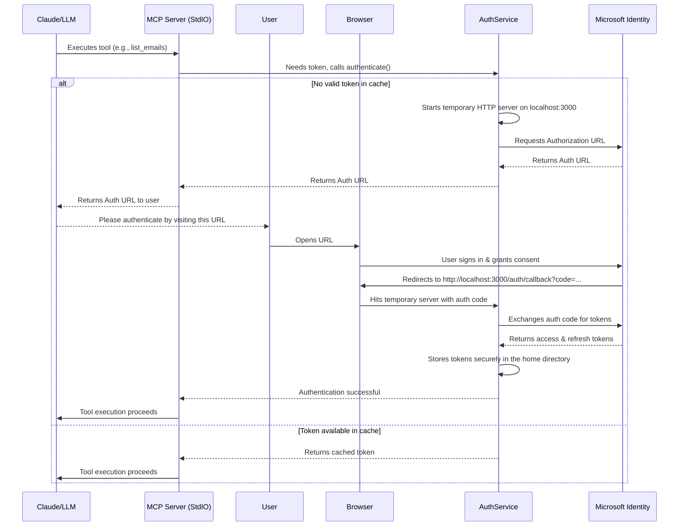

# Enhanced Outlook MCP Server

This is an enhanced, modular implementation of the Outlook MCP (Model Context Protocol) server that connects Claude with Microsoft Outlook through the Microsoft Graph API. This server provides a robust set of tools for email, calendar, folder management, and rule creation.

## Features

- **Complete Authentication System**: OAuth 2.0 authentication with Microsoft Graph API with token refresh and multiple user support
- **Email Management**: List, search, read, send, and organize emails with attachment support
- **Calendar Integration**: Create, modify, and manage calendar events with attendee tracking
- **Folder Organization**: Create, manage, and navigate email folders
- **Rules Engine**: Create and manage complex mail processing rules
- **Modular Architecture**: Clean separation of concerns for better maintainability and extensibility
- **Enhanced Error Handling**: Detailed error messages and logging
- **Test Mode**: Simulated responses for testing without real API calls
- **Rate Limiting**: Prevent API throttling with built-in rate limiting
- **Multi-environment Configuration**: Support for development, testing, and production environments

## Architecture and Interaction Flow

This server acts as a bridge between a Large Language Model (LLM) like Claude and the Microsoft Graph API. It exposes a suite of tools that the LLM can use to interact with a user's Outlook data.

### Server Architecture

The server is built with a modular Node.js architecture, with functionalities separated by concern into different directories (`auth`, `email`, `calendar`, etc.). The main entry point is `index.js`, which sets up a server that communicates over standard input/output (StdIO).

### LLM Interaction

Communication does not happen over a traditional HTTP API. Instead, the LLM environment starts the MCP server as a subprocess by executing the `start.sh` script. The LLM and the server then communicate over `stdin` and `stdout` using a JSON-RPC-like protocol. The LLM sends tool-call requests as JSON objects to the server's `stdin`, and the server sends back results on its `stdout`.

This StdIO-based approach simplifies setup, as it doesn't require managing ports or HTTP servers for the primary communication.

### Authentication Flow

The server uses the OAuth 2.0 Authorization Code Flow to securely authenticate with the Microsoft Graph API on behalf of the user. Since the main server doesn't listen on an HTTP port, it dynamically starts a temporary, lightweight web server only when needed for the OAuth redirect.

Here is a diagram of the authentication sequence:



Once authentication is complete, access tokens are cached securely in a file in the user's home directory. For subsequent tool calls, the server uses the cached token, refreshing it automatically when it expires.

## Directory Structure

```
/enhanced-outlook-mcp/
├── index.js                     # Main entry point
├── config.js                    # Configuration settings
├── .env.example                 # Example environment variables
├── auth/                        # Authentication modules
│   ├── index.js                 # Authentication exports
│   ├── token-manager.js         # Token storage and refresh
│   ├── multi-user-support.js    # Multiple user support
│   ├── tools.js                 # Auth-related tools
│   ├── auth-service.js          # Authentication service
│   ├── unified-index.js         # Backward compatibility
│   └── tools-api.js             # Auth-related tools API
├── email/                       # Email functionality
│   ├── index.js                 # Email exports
│   ├── list.js                  # List emails
│   ├── search.js                # Search emails
│   ├── read.js                  # Read email
│   ├── send.js                  # Send email
│   └── attachments.js           # Handle email attachments
├── calendar/                    # Calendar functionality
│   ├── index.js                 # Calendar exports
│   ├── create-event.js          # Create calendar events
│   ├── list-events.js           # List calendar events
│   ├── update-event.js          # Update calendar events
│   └── delete-event.js          # Delete calendar events
├── folder/                      # Folder management
│   ├── index.js                 # Folder exports
│   ├── list.js                  # List folders
│   ├── create.js                # Create folders
│   └── move.js                  # Move items between folders
├── rules/                       # Mail rules functionality
│   ├── index.js                 # Rules exports
│   ├── create.js                # Create mail rules
│   ├── list.js                  # List mail rules
│   └── delete.js                # Delete mail rules
└── utils/                       # Utility functions
    ├── enhanced-graph-api.js    # Enhanced Graph API client
    ├── graph-api-adapter.js     # Adapter for backward compatibility
    ├── odata-helpers.js         # OData query building
    ├── logger.js                # Logging utility
    ├── rate-limiter.js          # API rate limiting
    └── mock-data/               # Test mode mock data
        ├── emails.js            # Mock email data
        ├── folders.js           # Mock folder data
        ├── calendar.js          # Mock calendar data
        └── rules.js             # Mock rules data
```

## Installation

1. Clone the repository:
   ```
   git clone https://github.com/your-username/enhanced-outlook-mcp.git
   cd enhanced-outlook-mcp
   ```

2. Install dependencies:
   ```
   npm install
   ```

3. Create a `.env` file with your Microsoft App Registration details. See `GETTING_STARTED.md` for detailed instructions on how to register an application in Azure and obtain your client ID and secret.
   ```
   MS_CLIENT_ID=your_client_id
   MS_CLIENT_SECRET=your_client_secret
   # Additional configuration options
   ```

## Usage with Claude

1.  Configure the Claude desktop app to use the MCP server.
    - Open the Claude desktop configuration file. On macOS, this is located at `~/Library/Application Support/Claude/claude_desktop_config.json`.
    - Add the following entry to the `mcpServers` object, replacing `/path/to/project` with the absolute path to the `enhanced-outlook-mcp` directory:

    ```json
    "enhanced-outlook-mcp": {
      "command": "/path/to/project/start.sh"
    }
    ```

    Your `claude_desktop_config.json` should look similar to this:

    ```json
    {
      "mcpServers": {
        "enhanced-outlook-mcp": {
          "command": "/path/to/project/start.sh"
        }
      }
    }
    ```

2.  **Make the start script executable**:
    Open your terminal and run the following command from the project's root directory:
    ```bash
    chmod +x start.sh
    ```

3.  **Start the server via Claude**:
    There is no need to run `npm start` separately. Claude will automatically start the server using the configured command when you use one of its tools.

4.  Use the `authenticate` tool in Claude to initiate the authentication flow.

## Authentication Flow

1. Use the `authenticate` tool in Claude to get an authentication URL
2. Complete the authentication in your browser
3. Tokens are securely stored in the configured location

## Development

To run the server in development mode with auto-reload:
```
npm run dev
```

To run tests:
```
npm test
```

## License

MIT License

## Contributing

Contributions are welcome! Please feel free to submit a Pull Request.
